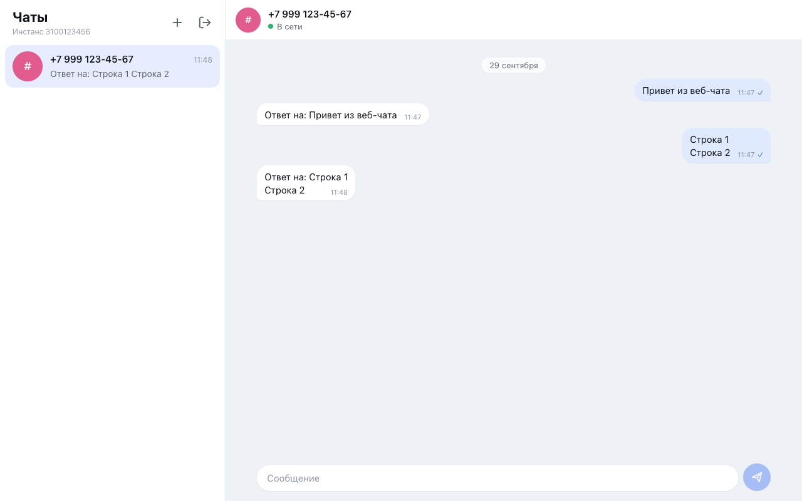

# Веб-чат MAX на GREEN-API

Минимальный веб-клиент в стиле web.max.ru. Он отправляет и получает **текстовые** сообщения MAX через [GREEN-API](https://green-api.com/v3/docs/) (v3).



**Деплой:** https://buzjen.github.io/Green-api-Max/ (GitHub Pages, обновляется на каждый пуш в `main`)

## Сценарий

1. Введите `idInstance` и `apiTokenInstance` из личного кабинета GREEN-API.
2. Нажмите «+» и введите номер получателя, например `+7 999 123-45-67`. Чат будет создан.
3. Напишите сообщение и нажмите Enter (Shift+Enter переносит строку).
4. Ответ собеседника появится в чате без перезагрузки страницы.

## Запуск

```bash
npm i
npm run dev      # http://localhost:5173
npm test         # юнит-тесты и тесты моделей effector
npm run lint     # ESLint + steiger (линтер границ FSD)
npm run build    # production-сборка в dist/
```

Нужен Node.js 20.19+ (требование Vite 8).

## Настройка инстанса (делается один раз в личном кабинете)

- Инстанс **авторизован в MAX**: отсканируйте QR-код в личном кабинете. Для входа по QR нужно отключить пароль входа в MAX. Если инстанс не авторизован, `SendMessage` поставит сообщение в очередь на 24 часа и не отправит его, а приложение этого не заметит.
- **`webhookUrl` пустой.** Иначе `ReceiveNotification` вернёт 400, и приложение покажет «Очистите webhookUrl в личном кабинете GREEN-API».
- Включено **`incomingWebhook: yes`** (получение входящих сообщений).
- Опционально **`outgoingWebhook: yes`**. Тогда в чате появятся и сообщения, отправленные с телефона.

### apiUrl

Хост API зависит от кластера инстанса. По умолчанию он вычисляется из первых 4 цифр `idInstance`: `3100123456` → `https://3100.api.green-api.com`. Хосты вида `{4 цифры}.api.green-api.com` существуют (проверено запросами к `1103`, `3100`, `7103`, `7105`), и документация GREEN-API приводит пример MAX-инстанса `310000001`. На реальном инстансе с живыми кредами правило **не проверялось**. Если в личном кабинете указан другой `apiUrl`, введите его в блоке «Дополнительно» на форме входа.

## Методы GREEN-API

Используются ровно 4 метода, других запросов приложение не делает:

| Метод                 | Зачем                                                                                                                                                                                                 |
| --------------------- | ----------------------------------------------------------------------------------------------------------------------------------------------------------------------------------------------------- |
| `SendMessage`         | отправка текста (до 4000 символов)                                                                                                                                                                    |
| `ReceiveNotification` | long-polling очереди входящих уведомлений (`receiveTimeout=20`)                                                                                                                                       |
| `DeleteNotification`  | удаление каждого полученного уведомления, даже нераспознанного, чтобы очередь не застревала                                                                                                           |
| `CheckAccount`        | номер → `chatId`. В MAX `chatId` — это внутренний числовой ID, а не `7999…@c.us`. Ответы приходят с ним, поэтому без `CheckAccount` их не сопоставить с чатом. Вызывается один раз при создании чата. |

Отдельного запроса для проверки кредов при входе нет. Проверкой служит первый `ReceiveNotification`, который стартует сразу после входа. При 401/403/400 сессия сбрасывается, и форма входа показывает причину ошибки.

CORS: GREEN-API отвечает `Access-Control-Allow-Origin: *`, поэтому запросы идут прямо из браузера, прокси и бэкенд не нужны.

## Архитектура

Стек: Vite + React 18 + TypeScript + effector, стили на [Linaria](https://linaria.dev/) (zero-runtime styled components), без UI-библиотек и роутера. Код разложен по слоям [Feature-Sliced Design](https://feature-sliced.design/), границы проверяет `steiger`.

```
src/
  app/            точка входа, appStarted (восстановление из хранилища), глобальные стили
  pages/          login, chat (двухколоночный layout, на мобильных — список или чат)
  widgets/        chat-sidebar (список чатов), chat-window (шапка, лента, поле ввода)
  features/
    auth/login                  форма входа, локальная валидация → sessionStarted
    auth/logout                 reset всех сущностей
    chat/create-by-phone        нормализация номера → CheckAccount → chatAdded/chatSelected
    message/send                оптимистичная отправка, статус, повтор при ошибке
    notifications/receive       цикл ReceiveNotification → DeleteNotification
  entities/
    session       креды, $isAuthorized, $sessionError
    chat          список чатов, активный чат
    message       сообщения по чатам (дедуп по idMessage), parseNotification
  shared/
    api/green-api   4 функции на fetch, ApiError, тексты ошибок
    config          resolveApiUrl
    lib             phone, storage (persist), date, testing (фикстуры тестов)
    ui              Button, Input, ErrorText, Avatar, Spinner, иконки;
                    ui/theme — токены темы (CSS-переменные), media, миксины
```

Принципы:

- Бизнес-логика живёт в `model/` на effector. Компоненты читают сторы через `useUnit` и вызывают события.
- `shared/api` ничего не знает про effector. Креды подставляет в эффекты `sessionModel.withCredentials(fx)`: хелпер возвращает событие, которое вызывает эффект с кредами текущей сессии и игнорируется без неё.
- Сущности не импортируют друг друга. Их связывают фичи через `sample`, каждая сущность экспортирует свой `reset`.

### Стили

- Компоненты стилизуются через `styled` из `@linaria/react`. Стили лежат в `*.styles.ts` рядом с компонентом. На этапе сборки Linaria (плагин `@wyw-in-js/vite`) извлекает их в обычный CSS, в рантайме остаются только классы, а динамические значения становятся CSS-переменными.
- Цвета и тени берутся из `shared/ui/theme`: `color: ${theme.accent}` превращается в `var(--accent)`. Значения светлой и тёмной темы объявлены там же, а в `:root` их выводит `app/styles/global.ts`.
- Варианты и состояния задаются data-атрибутами (`data-variant`, `data-active`, `data-direction`), а не отдельными классами.
- Модули `*.styles.ts` импортируют тему из `@/shared/ui/theme`, а не из barrel `@/shared/ui`. Иначе Linaria при сборке вычисляет весь barrel вместе с React-компонентами, и сборка падает.
- Разметка минимальная: `div`/`span` плюс элементы с поведением (`button`, `form`, `input`, `textarea`, `label`, `a`, `details`). У кнопок-иконок есть подсказка в `title`.

### Цикл получения

- Цикл запускается по `sessionModel.sessionStarted` (не из React-эффекта, поэтому StrictMode не создаёт второй цикл) и останавливается по `sessionModel.reset` или `sessionFailed`. Запрос, который в этот момент в полёте, отменяется через `AbortController`.
- Шаги связаны цепочкой `sample`, поэтому одновременно в полёте не больше одного запроса, `setInterval` не используется.
- У каждого запуска есть номер поколения. Ответы и таймеры прошлого поколения игнорируются, так что быстрый выход и повторный вход не создают второй цикл.
- При сетевой ошибке ставится статус «Нет соединения» и делаются паузы 1 → 2 → 5 с перед повтором.
- Разбираются типы `incomingMessageReceived` и `outgoingMessageReceived` (отправлено с телефона) с `textMessage`/`extendedTextMessage`. `outgoingAPIMessageReceived` (эхо собственной отправки) и все остальные уведомления удаляются из очереди без обработки.
- Если сообщение пришло от собеседника, для которого чата ещё нет, чат создаётся автоматически. Сначала чат ищется по `chatId`, затем по `senderPhoneNumber`.

### Хранение

Креды, чаты и последние 300 сообщений каждого чата хранятся в `localStorage`, поэтому после F5 сессия и история остаются. Кнопка «Выйти» сбрасывает все сущности, и они удаляют свои ключи из хранилища. Синхронизацию делает общий хелпер `persist` из `shared/lib/storage`: он пишет каждое обновление стора и отдаёт сохранённое значение по событию восстановления. Внешняя зависимость вроде `effector-storage` не нужна.

## Тесты

- `shared/lib/phone`, `shared/config`, `features/auth/login/lib`: чистые функции.
- `entities/message/lib/parseNotification`: text, extendedText, исходящие с телефона, игнорируемые типы.
- Модели effector через `fork` + `allSettled` с подменой эффектов, без сети:
  - получение: уведомление удаляется даже при нераспознанном body, дубликаты не добавляются, после выхода новые запросы не уходят, backoff при сетевой ошибке, неверные креды и `webhookUrl` → ошибка на форме входа;
  - отправка: оптимистичное добавление, статусы, повтор;
  - создание чата: `CheckAccount`, «номер не в MAX», невалидный номер, повторное создание без лишнего `CheckAccount`.

## Ограничения

- Только текстовые сообщения. Медиа, реакции, группы, редактирование и статусы прочтения не поддерживаются (намеренно, по ТЗ).
- Номера только России (+7) и Беларуси (+375): это ограничение `CheckAccount` в MAX.
- История не подтягивается с сервера, видны только сообщения, полученные с момента входа в этом браузере.
- Две открытые вкладки делят одну очередь уведомлений: каждое сообщение увидит только одна из них.
- Частые вызовы `CheckAccount` ограничены GREEN-API (ошибка 469). Приложение вызывает его только при создании нового чата.
- Креды хранятся в `localStorage` открытым текстом. Используйте «Выйти» на чужих устройствах.
